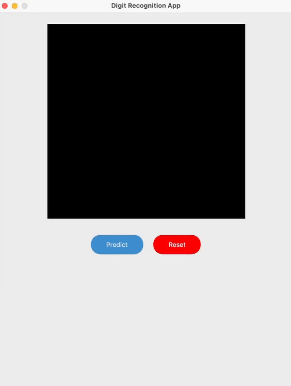

# LeNet-5 From Scratch 

This repository contains the implementation of LeNet-5 Convolutional Neural Network (CNN) Architecture from scratch using numpy. LeNet-5 is a pioneering architecture in the field of deep learning, particularly for handwritten digit classification on the MNIST dataset, developed in the 90s by Yann LeCun.

<p align="center"> 
  
</p>

## Architecture


## Table of Content
1. `models/` - A directory storing Pickle files for pre-trained models for inference
2. `modules/` - A directory comprises of the implementation of the layers, loss functions, optimizers and all other modules of the model
3. `LeNet5_RBF_model.ipynb` - The implementation of LeNet-5 with the original RBF output layer
4. `LeNet5_softmax_model.ipynb` - The implementation of LeNet-5 with softmax output for higher prediction accuracy
5. `app.py` - The implementation of the handwritten digit recognition app with LeNet-5 as the model using tkinter


## Installation
### Clone the Repository
```bash
git clone https://github.com/T0mLam/LeNet-5-from-scratch.git
cd LeNet-5-from-scratch
```
### Install dependencies
```bash
pip install -r requirements.txt
```


## Usage
### Launch the app
```bash
python -m app.py
```
### Import and use the modules
Create a new file `experiment.py`

```python
# Use the format 'from modules.{filename} import {module}'

# e.g. import the Adam optimizer
from modules.optimizer import Adam
...
optimizer = Adam(model, lr=0.001)

```

Run the script
```bash
python -m experiment.py
```

## Acknowledgements
- Yann Lecun for the [LeNet paper](https://ieeexplore.ieee.org/document/726791)
